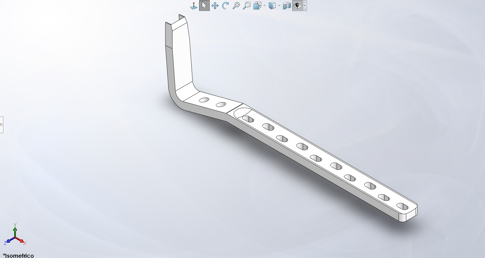
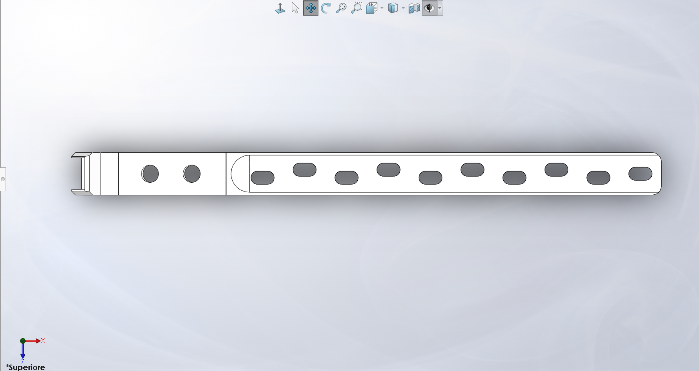
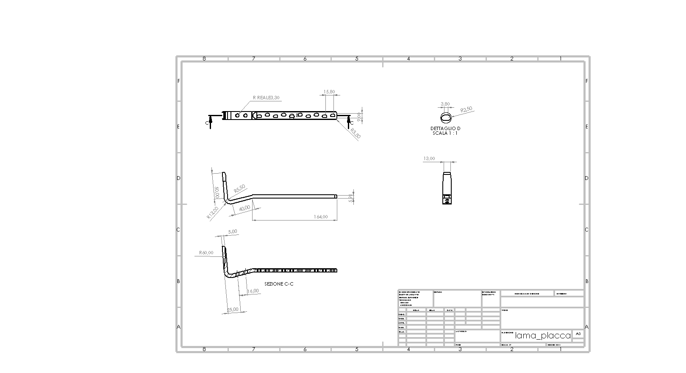

# Surgical Plate CAD Reconstruction

Educational CAD reconstruction of an orthopaedic blade-plate geometry starting from a technical drawing.

---

## Final CAD Model

### Isometric View



---

### Top View



---

## Project Objective

The goal of this project was to reconstruct a surgical blade-plate component starting from a technical drawing and reproduce it through a clean SolidWorks workflow.

Main objectives:

- technical drawing interpretation
- parametric CAD modeling
- blade geometry reconstruction
- hole generation
- technical documentation
- CAD export preparation

---

## Technical Drawing



---

## CAD Workflow

1. Analysis of reference drawing  
2. Base profile sketch  
3. Base extrusion  
4. Blade generation  
5. Hole creation  
6. Finishing features  
7. Technical drawing generation  
8. Export preparation  

---

## Final Outputs

- SolidWorks part file (.SLDPRT)
- Technical drawing (.PDF)
- STEP export
- STL export
- Render images

---

## Tools Used

- SolidWorks
- Technical Drawing
- CAD Modeling

---

## Repository Structure

```bash
CAD/
Drawings/
Renders/
```

---

## Project Note

This project was developed as an educational CAD exercise focused on reverse engineering and biomedical device-related geometries.

It does not represent a certified medical device.
